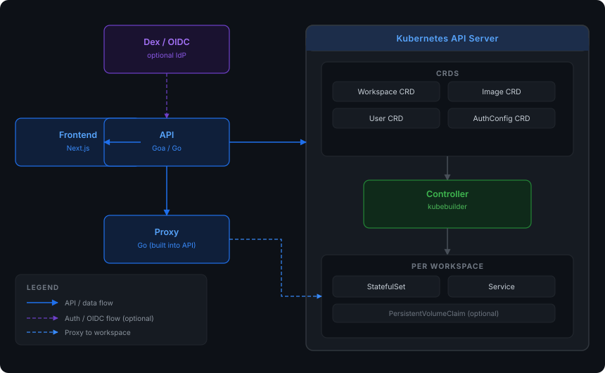

# Overview

Kube Workspaces is a Kubernetes-native platform for managing container-based
workspaces and full Linux desktops from a web browser. Workspaces run as pods
in your own cluster, so every developer gets an isolated, reproducible
environment without provisioning VMs — and the platform requires no external
database.

Modelled on the Kubeflow Notebooks architecture but as a standalone,
lightweight solution.

## How it works

Four loosely-coupled components are deployed to your cluster:

- **Controller** — a Kubernetes controller (kubebuilder) that reconciles the
  `Workspace`, `Image`, `User`, `AuthConfig`, and `PlatformConfig` custom
  resources.
- **API** — a REST service (Goa) for workspace CRUD, volumes, images,
  authentication, and administration.
- **Proxy** — a reverse proxy that routes browser traffic to workspace web UIs,
  with WebSocket support and per-request namespace access control.
- **Frontend** — a Next.js web UI for managing workspaces, volumes, users, and
  cluster resources.

The controller turns each `Workspace` CR into a `StatefulSet` and `Service` in
the cluster — a workspace is a real Kubernetes pod, so it can use any image,
resource limits, or volume mounts. State lives in CRDs and Secrets; there is no
separate database to run or back up.

## Key capabilities

- **Full PodSpec flexibility** — a workspace wraps a complete Kubernetes
  `PodSpec`, so any container configuration works.
- **Browser-based access** — a built-in reverse proxy exposes workspace web UIs
  (VS Code Server, Jupyter, noVNC desktops, and anything else that serves HTTP)
  through the frontend, with full WebSocket support.
- **Optional authentication** — OIDC (Dex, Okta, Auth0, Google, Keycloak, or
  any OIDC provider) or built-in local accounts. Off by default.
- **Kubernetes-native RBAC** — three roles (admin, editor, viewer) with
  namespace-level access control.
- **Personal namespaces** — auto-created per user, with configurable naming and
  resource quotas.
- **Start / stop workspaces** — annotation-driven, so a workspace can be paused
  without being deleted.
- **Volumes** — create, list, and attach PVCs to workspaces.
- **No database required** — all state lives in CRDs, Secrets, and native
  RBAC objects.

## Deployment

The platform ships as a Helm chart, Kustomize manifests, and an Argo CD
Application, all publishing the same images to
`ghcr.io/kube-workspaces/*`. Install on any cluster — see
[Installation](install.md) for the supported methods. For a local development
loop, the same manifests deploy to a kind cluster in minutes.

## The image catalog

Any container image that serves HTTP can be a workspace. The
[kube-workspaces/image-catalog](https://github.com/kube-workspaces/image-catalog)
repository is the source of truth for ready-to-use workspace images, vendored
into the deployment manifests and exposed through the UI.

## Going further

- [Installation](install.md) — deploy with kind, Kustomize, Helm, or Argo CD
- [Authentication](authentication.md) — enable OIDC or local auth
- [Customizing your domain](domains.md) — hostnames and ingress routing
- [Proxy](proxy.md) — how workspace traffic is routed
- [Security](security.md) — what is hardened by default
- [Releasing](releasing.md) — how releases are cut
- [Testing](testing.md) — the test suite and how to run it