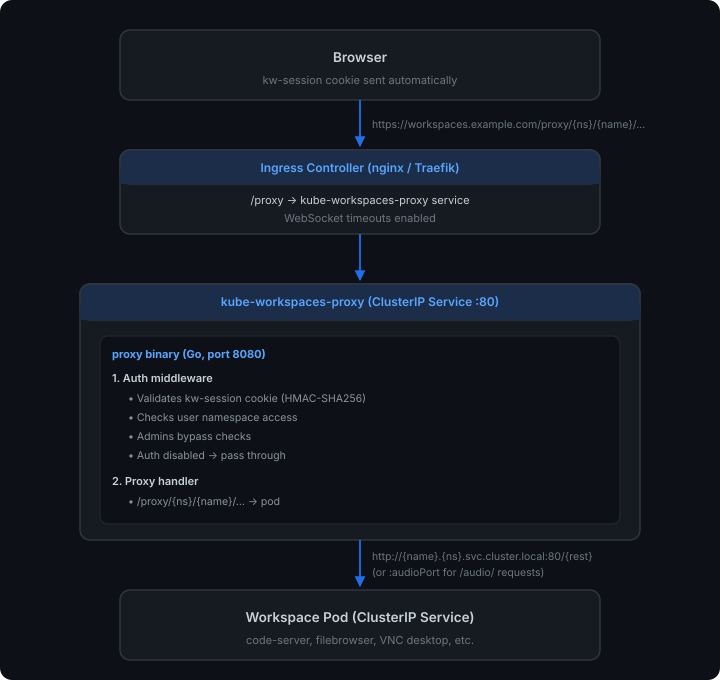

# Proxy Architecture

This document describes how workspace application proxying works in kube-workspaces. The proxy is a **standalone service** (`proxy/`) deployed independently from the API, with **session-based authentication** and **namespace access control**.

All proxy traffic flows through the main host via the cluster's ingress controller (e.g. nginx or Traefik):

```
https://workspaces.example.com/proxy/{namespace}/{name}/...
```

The `kw-session` cookie (same domain) provides authentication automatically.

---

## Overview

When a user opens a workspace application (e.g. code-server, filebrowser, a VNC desktop), the browser loads the app through the reverse proxy. The proxy validates the user's session and checks they have access to the workspace's namespace before forwarding the request.

### URL Format

```
https://workspaces.example.com/proxy/{namespace}/{name}/{path}
```

Example:
```
https://workspaces.example.com/proxy/user1/my-codeserver/
```

The request flows through the ingress controller (`/proxy` path) to the proxy service. The proxy validates the `kw-session` cookie, checks namespace access, then forwards to the workspace pod.

---

## Component Architecture



---

## Authentication & Authorization

The proxy enforces the same auth model as the API:

### Auth Flow

1. User navigates to `/proxy/{namespace}/{name}/...`
2. Ingress forwards to proxy service
3. Proxy auth middleware:
   - Reads `kw-session` cookie (or `Authorization: Bearer` header)
   - If no token → **401 Unauthorized**
   - Validates HMAC-SHA256 signature using signing key from K8s Secret
   - If invalid/expired → **401 Unauthorized**
   - Checks if email is in `adminEmails` → grants admin role override
   - If admin → **pass through** (skip namespace check)
   - Looks up User CR by email (not cached — instant revocation)
   - If user disabled → **403 Forbidden**
   - Checks `UserHasNamespaceAccess(user, namespace)` → personal NS + `spec.namespaceAccess[]`
   - If no access → **403 Forbidden**
   - Otherwise → **forward to proxy handler**

### Auth Bypass Conditions

| Condition | Behavior |
|-----------|----------|
| `AuthConfig.spec.enabled = false` | All requests pass through (no auth) |
| AuthConfig CR not found | Auth disabled (fail-open, backward compatible) |
| Admin role (via CR or `adminEmails`) | Skip namespace access check |
| Health endpoints (`/healthz`, `/readyz`) | Always pass through |
| Root endpoint (`/`) | Always pass through |

### Caching Strategy

| Resource | Caching | Purpose |
|----------|---------|---------|
| AuthConfig + signing key | 30-second TTL | Matches API behavior; avoids per-request Secret reads |
| User CRs | **Not cached** | Looked up on every request for instant revocation |
| Image CRs | 30-second TTL | Reduces API calls when resolving proxyConfig |
| Workspace image | 10-second TTL | Short TTL since workspace image rarely changes |

The proxy's K8s client is configured with `QPS: 50` and `Burst: 100` to prevent client-side throttling under load. Without this, the default client rate limits (5 QPS) caused 3-4 second delays on proxied requests.

This ensures user disabling and namespace access revocation take effect immediately, while reducing unnecessary API server load for static configuration.

### RBAC Permissions

The proxy ServiceAccount (`kube-workspaces-proxy`) has:

**ClusterRole:**
```yaml
rules:
  - apiGroups: ["kubeworkspaces.io"]
    resources: ["images"]
    verbs: ["list"]
  - apiGroups: ["kubeworkspaces.io"]
    resources: ["workspaces"]
    verbs: ["get"]
  - apiGroups: ["kubeworkspaces.io"]
    resources: ["authconfigs"]
    verbs: ["get"]
  - apiGroups: ["kubeworkspaces.io"]
    resources: ["users"]
    verbs: ["get", "list"]
```

**Role (namespaced to kube-workspaces-system):**
```yaml
rules:
  - apiGroups: [""]
    resources: ["secrets"]
    verbs: ["get"]
```

The namespaced Role limits Secret access to only the deployment namespace (where the signing key Secret lives).

---

## The Proxy Service (`proxy/`)

**Source:** `proxy/cmd/proxy/main.go`, `proxy/internal/proxy/proxy.go`, `proxy/internal/auth/`

The proxy is a standalone Go binary with minimal dependencies:
- stdlib `net/http` + `net/http/httputil` for reverse proxying
- `k8s.io/client-go` dynamic client for reading CRs and Secrets
- Custom HMAC-SHA256 token validation (same format as the API)
- No Goa framework, no database

### Request Flow

```
Client request arrives
        ↓
CORS middleware (origin check)
        ↓
Auth middleware:
  /healthz, /readyz, /, /sw.js → skip auth
  Auth disabled → skip auth
  Validate token → 401 if invalid
  Check namespace access → 403 if denied
        ↓
Root handler routing:
  /healthz, /readyz → health check response
  /sw.js → no-op ServiceWorker
  /proxy/{ns}/{name}/... → proxy handler
  Referer-based recovery → rewrite + proxy handler
  / → service info JSON
  Other: 404
        ↓
Proxy handler:
  Parse namespace, name, rest from URL
  Look up Workspace CR → extract container image
  Look up Image CRs → find proxyConfig
  Build target: http://{name}.{namespace}.svc.cluster.local:80/{rest}
  Forward via httputil.ReverseProxy
        ↓
Response modifications:
  Location header rewriting
  HTML rewriting (code-server, base tag)
        ↓
Response returned to client
```

### Target Resolution

The proxy constructs the backend URL using Kubernetes DNS:

```
http://{workspace-name}.{namespace}.svc.cluster.local:80/{rest}
```

- Port 80 is used by default (workspace Services map port 80 to the container's `defaultPort`)
- If `audioPort` is configured and the request path matches `/audio/`, the proxy routes to that port instead (e.g., port 6902)
- The scheme is `http` unless `scheme: https` is set (or the deprecated `tlsInsecure: true`); `tlsSkipVerify` controls certificate verification

### WebSocket Support

WebSocket connections are handled transparently by `httputil.ReverseProxy`. The proxy preserves `Connection` and `Upgrade` headers when an upgrade is requested. The `FlushInterval: -1` setting enables streaming for long-lived connections.

Because WebSocket connections can be long-lived, configure your ingress controller to allow extended timeouts. The exact mechanism depends on the controller:

- **nginx ingress**: set `proxy-read-timeout`/`proxy-send-timeout` annotations:
  ```yaml
  nginx.ingress.kubernetes.io/proxy-read-timeout: "3600"
  nginx.ingress.kubernetes.io/proxy-send-timeout: "3600"
  ```
- **Traefik**: WebSocket upgrades bypass the HTTP router timeouts, so no extra configuration is required.
- **Other controllers**: consult your controller's docs for long-lived/WebSocket connection settings.

### Request Header Modifications

The Director function applies these transformations:

| Header | Behavior |
|--------|----------|
| `Host` | Set to original request Host |
| `X-Forwarded-Host` | Set to original request Host |
| `X-Forwarded-Proto` | Set to `https`/`http` based on upstream header |
| `Connection` | Removed unless WebSocket upgrade |
| `Accept-Encoding` | Removed (forces decompression for response rewriting) |
| Custom headers | Injected from `proxyConfig.customRequestHeaders` |

### Response Modifications

#### Location Header Rewriting

All `Location` headers in responses are rewritten to stay under the proxy prefix:

- Absolute URL → proxy prefix + path (e.g. `http://pod.ns.svc/login` → `/proxy/{ns}/{name}/login`)
- Absolute path → proxy prefix + path (e.g. `/login` → `/proxy/{ns}/{name}/login`)
- Relative path → resolved relative to current proxy path

#### HTML Response Rewriting

For `text/html` responses (when a proxyConfig exists), the proxy performs:

1. **`<base>` tag injection** (when `injectBaseTag: true`): Inserts `<base href="/proxy/{ns}/{name}/">` after `<head>`, causing the browser to resolve all relative and absolute URLs through the proxy path.

2. **code-server `remoteAuthority` rewrite**: Replaces `"remoteAuthority":"remote:443"` with the actual browser hostname so VS Code's WebSocket connects through the proxy.

3. **code-server `serverBasePath` rewrite**: Replaces `"serverBasePath":"."` with the proxy prefix path.

4. **code-server `rootEndpoint` rewrite**: Replaces `"rootEndpoint":"."` with the proxy prefix path.

The proxy handles gzip-encoded responses by decompressing before rewriting and re-compressing after.

### Escaped Request Recovery

The proxy includes multiple layers of recovery for requests that escape the path prefix:

#### Layer 1: Referer-based recovery (proxy-side)

If a request arrives at a path that doesn't match `/proxy/{ns}/{name}/...`, the proxy checks the `Referer` header:

```go
referer := r.Header.Get("Referer")
if referer != "" {
    proxyPrefix := proxy.ExtractProxyPrefix(referer, pathPrefix)
    if proxyPrefix != "" {
        r.URL.Path = proxyPrefix + r.URL.Path
        // forward to proxy handler
    }
}
```

This catches requests from workspace apps that use absolute paths like `/js/app.js`.

#### Layer 2: Cookie-based recovery (`kw-proxy-prefix`)

For requests without a `Referer` header (e.g. WebSocket upgrades from KasmVNC), the proxy sets a `kw-proxy-prefix` cookie on HTML responses:

```
Set-Cookie: kw-proxy-prefix=/proxy/{ns}/{name}; Path=/; SameSite=Lax
```

When the frontend production server receives an escaped request (e.g. `/websockify`) without a Referer, it reads this cookie to reconstruct the correct proxy path and forwards the request to the proxy service.

**Flow:**
1. Browser loads workspace at `/proxy/ns/name/` → proxy sets `kw-proxy-prefix=/proxy/ns/name`
2. KasmVNC client connects to `/websockify` (root-relative, no Referer)
3. Request hits frontend server (catch-all ingress)
4. Frontend reads `kw-proxy-prefix` cookie → rewrites to `/proxy/ns/name/websockify`
5. Frontend forwards to proxy service → proxy strips prefix → forwards to pod

**Path blocklist:** The frontend does NOT apply cookie-based recovery to known frontend routes:
`/workspaces`, `/admin`, `/auth`, `/api`, `/login`, `/volumes`, `/profile`, `/_next`, `/favicon`, `/manifest`, `/sw.js`, `/images`, `/icons`

### No-Op Service Worker

The proxy serves a no-op ServiceWorker at `/sw.js`:

```javascript
self.addEventListener('install', () => self.skipWaiting());
self.addEventListener('activate', (e) => e.waitUntil(self.clients.claim()));
```

This is also served from `frontend/public/sw.js` for the case where the request hits the frontend instead.

### Bot Filtering

The proxy validates namespace and name segments against Kubernetes naming rules before attempting lookups:
- Must start/end with lowercase alphanumeric
- Middle characters: lowercase alphanumeric or hyphens
- Max 253 characters

This rejects scanner probes like `.git/HEAD`, `.ssh/id_rsa`, `wp-admin`, etc. without hitting the Kubernetes API.

### Error Handling

If the proxy cannot connect to the workspace pod, it returns:

```json
{"error": "Failed to connect to workspace: <reason>"}
```

with HTTP status 502 (Bad Gateway).

### Health Checks

| Endpoint | Purpose |
|----------|---------|
| `/healthz` | Liveness probe |
| `/readyz` | Readiness probe |

Both return `{"status":"ok"}` with HTTP 200. Health checks bypass auth.

### Request Logging

The proxy includes logging middleware that records every non-health request:

```
2024/01/15 10:30:42 GET /proxy/user1/my-code/ → 200 (45ms)
2024/01/15 10:30:43 GET /proxy/user1/my-code/static/app.js → 200 (12ms)
```

Logged fields: method, path, status code, duration. Health check endpoints (`/healthz`, `/readyz`) are excluded to reduce noise.

### Graceful Shutdown

The proxy handles `SIGINT` and `SIGTERM` with a 30-second graceful shutdown window, allowing in-flight requests (including WebSocket connections) to complete.

---

## Ingress

The Ingress resource handles routing (`kustomize/base/ingress.yaml`). The manifests declare `ingressClassName` and a `cert-manager.io/cluster-issuer` annotation, so they work with any Ingress controller (nginx, Traefik, etc.) — just set `ingressClassName` to the controller installed in your cluster.

### Primary Ingress (`kube-workspaces`)

Direct path-based routing without rewriting:

| Path | Backend | Notes |
|------|---------|-------|
| `/v1` | API | REST API endpoints |
| `/auth` | API | OIDC/local login, callback, session endpoints |
| `/openapi` | API | OpenAPI spec |
| `/proxy` | **Proxy** | Workspace reverse proxy (auth-enabled) |
| `/` (catch-all) | Frontend | Next.js app |

Annotation:
- `cert-manager.io/cluster-issuer: letsencrypt-production`

> **WebSocket note:** if using nginx ingress, add `proxy-read-timeout`/`proxy-send-timeout` annotations (see the [WebSocket Support](#websocket-support) section). Traefik handles WebSocket upgrades without additional annotations.

### Routing Summary

| Browser URL | Routed to | Service receives |
|-------------|-----------|------------------|
| `/proxy/ns/name/path` | Proxy (direct) | `/proxy/ns/name/path` |
| `/v1/workspaces` | API (direct) | `/v1/workspaces` |
| `/workspaces` | Frontend | N/A |
| `/admin` | Frontend | N/A |

### Dedicated API Subdomain

A second host rule routes `api.workspaces.example.com` directly to the API with no path rewriting.

---

## Next.js Frontend

### Proxy file (`frontend/src/proxy.ts`)

**Purpose:** Catch requests that "escape" the proxy prefix.

Workspace apps served under `/proxy/ns/name/...` may use absolute paths like `/static/app.js`. The browser sends these to the frontend (catch-all ingress). The proxy file detects this via the `Referer` header and redirects back to the proxy.

**How it works:**

1. A user views a workspace app at `/proxy/ns/name/`
2. The app's JavaScript requests `/static/app.js` (absolute path)
3. The browser sends this to the frontend (catch-all ingress rule)
4. Proxy file inspects the `Referer` header
5. Extracts the proxy prefix: `/api/proxy/ns/name`
6. Responds with **308 Permanent Redirect** to `/api/proxy/ns/name/static/app.js`
7. Browser follows redirect → ingress routes to proxy service

**Exclusions** (not redirected):
- `/_next/*` — Next.js internals
- Known kube-workspaces paths: `/api/v1/`, `/api/admin/`, `/api/auth/`, `/workspaces`, `/volumes`, `/admin`, etc.

### Frontend Proxy URL Generation

`frontend/src/lib/api.ts` exports:

```typescript
// All proxy traffic goes through the main host
export function getProxyUrl(namespace: string, name: string, path: string): string {
  const cleanPath = path.startsWith("/") ? path.slice(1) : path;
  return `/proxy/${namespace}/${name}/${cleanPath}`;
}
```

Example: `getProxyUrl("user1", "my-code", "/")` → `/proxy/user1/my-code/`

The `kw-session` cookie is sent automatically because the proxy is on the same domain.

### Dev Server Proxy (`frontend/server.mjs`)

The custom dev server replicates production routing for local development:

**Proxied paths:** `/api/*`, `/auth/*`, `/proxy/*` → API (default `http://localhost:8090`)

**Path rewriting:** `/api/...` is stripped to `/...` before forwarding (mirrors the ingress-level rewrite used by controllers like nginx: `rewrite-target: /$2`).

### Production Server (`frontend/server-prod.mjs`)

In production, the frontend uses a subprocess architecture to handle escaped proxy requests:

**Architecture:**
1. `server-prod.mjs` listens on port 3000 (the container's exposed port)
2. It spawns `node server.js` (Next.js standalone output) on an internal port (3001)
3. All requests pass through `server-prod.mjs` which acts as a transparent proxy

**Escaped request recovery:**
- Checks `Referer` header for proxy prefix extraction
- Falls back to `kw-proxy-prefix` cookie when no Referer is present
- Applies path blocklist (`FRONTEND_PATH_PREFIXES`) to avoid hijacking app routes
- Forwards recovered requests to the proxy service (`PROXY_URL` env var)

**Why subprocess?** The Next.js standalone `server.js` relies on webpack internals that aren't available when importing it directly. The subprocess approach avoids this dependency issue while still allowing the proxy logic wrapper.

**Handles `/sw.js`:** Serves a no-op ServiceWorker directly (prevents noVNC registration errors).

---

## ProxyConfig Options

The `proxyConfig` field on Image CRs controls per-image proxy behavior. These settings are defined in the `ImageProxyConfig` struct (`controller/api/v1alpha1/image_types.go`) and read by the proxy service at request time via the K8s API.

### `needsNoopSW`

```yaml
proxyConfig:
  needsNoopSW: true
```

**Type:** `bool` (default: `false`)

**Effect:** Enables serving a no-op ServiceWorker script at `/sw.js`. Many web applications (noVNC, code-server, KasmVNC) attempt to register a ServiceWorker at the root scope. The no-op SW satisfies the browser's registration requirement without interfering with the application.

**When to use:** Enable for any app that registers a ServiceWorker.

---

### `rewriteHostAbsolutePaths`

```yaml
proxyConfig:
  rewriteHostAbsolutePaths: true
```

**Type:** `bool` (default: `false`)

**Effect:** Enables Referer-based request rewriting at the proxy level. When the proxy receives a request that doesn't match a valid workspace path, it checks the `Referer` header and internally rewrites the request.

**When to use:** Enable for apps that use absolute paths for assets or API calls. Safe to enable by default.

---

### `injectBaseTag`

```yaml
proxyConfig:
  injectBaseTag: true
```

**Type:** `bool` (default: `false`)

**Effect:** Injects a `<base href="/proxy/{namespace}/{name}/">` tag into all HTML responses. This tells the browser to resolve all relative URLs relative to the workspace's proxy prefix.

**When to use:** Use for apps that load resources with relative paths but don't support a configurable base URL. Prefer the app's native base URL configuration (like `FB_BASEURL` for filebrowser) when available.

**Caution:** The `<base>` tag can break apps that rely on `window.location.pathname` for routing.

---

### `scheme`

```yaml
proxyConfig:
  scheme: https
```

**Type:** `string`, one of `http` or `https` (default: `http`)

**Effect:** Selects the URL scheme the proxy uses to reach the workspace pod.

**When to use:** Set `https` for images that serve TLS on their workspace port
(e.g. KasmVNC desktops, `linuxserver/kasm`). Leave unset — or set `http`
explicitly — for images serving plain HTTP.

---

### `tlsSkipVerify`

```yaml
proxyConfig:
  scheme: https
  tlsSkipVerify: true
```

**Type:** `bool` (default: `false`)

**Effect:** When connecting over HTTPS, skips verification of the workspace's TLS
certificate (`InsecureSkipVerify: true`). Has no effect when the scheme is `http`.

**When to use:** Required for images serving self-signed certificates, which is
typical for KasmVNC-based desktops. Omit it when the workspace presents a
certificate signed by a CA the proxy trusts.

---

### `tlsInsecure` (deprecated)

```yaml
proxyConfig:
  tlsInsecure: true   # equivalent to: scheme: https + tlsSkipVerify: true
```

**Type:** `bool` (default: `false`)

**Status:** Deprecated — use [`scheme`](#scheme) and
[`tlsSkipVerify`](#tlsskipverify) instead.

This single flag conflated two independent decisions: which scheme to dial, and
whether to verify the certificate. As a result "HTTPS with a valid CA" was
impossible to express, and the name misleadingly suggested it disabled TLS rather
than enabling it.

It is still honoured for backwards compatibility: when `scheme` is unset,
`tlsInsecure: true` implies **both** `scheme: https` and `tlsSkipVerify: true`.
An explicit `scheme` always takes precedence.

---

### `websocketPaths`

```yaml
proxyConfig:
  websocketPaths:
    - /websockify
```

**Type:** `[]string` (default: `nil`)

**Effect:** Currently informational only. Documents which paths use WebSocket connections. The Go reverse proxy supports WebSocket upgrade transparently on ALL paths.

---

### `customRequestHeaders`

```yaml
proxyConfig:
  customRequestHeaders:
    X-Custom-Header: "value"
```

**Type:** `map[string]string` (default: `nil`)

**Effect:** Injects additional HTTP headers into every proxied request sent to the workspace pod.

---

### `preservePathPrefix`

```yaml
proxyConfig:
  preservePathPrefix: true
```

**Type:** `bool` (default: `false`)

**Effect:** When enabled, the proxy forwards the full request path including the proxy prefix (`/proxy/{namespace}/{name}/...`) to the workspace pod, instead of stripping it. This is required for applications that are configured with a base URL matching the proxy prefix.

**How it works:**

Without `preservePathPrefix` (default):
```
Browser → /proxy/ws/my-fb/api/login
Proxy strips prefix → forwards /api/login to pod
App handles /api/login directly
```

With `preservePathPrefix: true`:
```
Browser → /proxy/ws/my-fb/api/login
Proxy preserves prefix → forwards /proxy/ws/my-fb/api/login to pod
App strips its configured baseURL (/proxy/ws/my-fb) → handles /api/login
```

**When to use:** Required for apps that:
1. Support a base URL/path prefix configuration (CLI flag, env var, config file)
2. Use that configuration to both generate URLs AND route incoming requests via path prefix stripping
3. Would otherwise have root-relative paths that escape the proxy

**Location header handling:** When `preservePathPrefix` is true, the proxy assumes the app generates Location headers with the full prefix already included, so it doesn't double-prefix them.

**Example with filebrowser:**
```yaml
spec:
  defaultEnv:
    - name: FB_BASE_URL
      value: /proxy/{{namespace}}/{{name}}
  proxyConfig:
    preservePathPrefix: true
    needsNoopSW: true
```

---

### `audioPort`

```yaml
proxyConfig:
  audioPort: 6902
```

**Type:** `int32` (default: `0` — disabled)

**Effect:** Routes requests matching `/audio/` to a different backend Service port instead of the default port 80. This enables audio WebSocket streams to be served from a separate process within the workspace pod (e.g., PulseAudio via websockify on port 6902).

**How it works:**

Without `audioPort` (default):
```
Browser → /proxy/ns/name/audio/ → proxy → workspace-svc:80/audio/
```

With `audioPort: 6902`:
```
Browser → /proxy/ns/name/audio/ → proxy → workspace-svc:6902/audio/
```

**Prerequisites:**
1. The workspace container must expose the audio port (use `additionalPorts` on the Image CR)
2. The controller's `generateService` exposes all container ports — the first port maps to Service port 80, additional ports map to their own port number
3. The audio process in the container must listen on the specified port

**When to use:** For desktop workspace images that have a separate audio streaming service (PulseAudio → GStreamer → websockify) running on a different port from the main VNC/web interface.

**Example with debian-desktop:**
```yaml
spec:
  defaultPort: 6901
  additionalPorts:
    - name: audio
      port: 6902
  proxyConfig:
    needsNoopSW: true
    rewriteHostAbsolutePaths: true
    audioPort: 6902
```

The audio plugin in the browser requests `/audio/` which, through escaped request recovery (cookie-based), becomes `/proxy/{ns}/{name}/audio/`. The proxy detects the `/audio/` path and routes it to Service port 6902 instead of port 80.

> **`audioPort` requires a matching `additionalPorts` entry.** `audioPort` only
> tells the proxy where to route `/audio/`; it does not expose the port. The
> workspace Service is generated from the container ports, which come from
> `additionalPorts`. Setting `audioPort` alone leaves the port unreachable and
> noVNC fails with `Uncaught Error: Protocol error` from `audio-plugin.js`.

---

## Image CR `defaultEnv` and Base URL Configuration

Some applications support a base URL configuration that's more robust than proxy-side rewriting. This is configured via the Image CR's `defaultEnv` field with template placeholders:

```yaml
spec:
  defaultEnv:
    - name: FB_BASE_URL
      value: /proxy/{{namespace}}/{{name}}
```

**Supported placeholders:**
- `{{namespace}}` — workspace's Kubernetes namespace
- `{{name}}` — workspace name

These are substituted at workspace creation time. Existing workspaces must be recreated to pick up changes.

**Why this is preferred over `injectBaseTag`:** When an app natively understands its base URL, it generates all internal URLs correctly (API calls, asset paths, redirects). This is more reliable than proxy-side HTML rewriting.

### Port Forwarding (code-server / OpenVSCode Server)

IDE workspace images like code-server and OpenVSCode Server have a built-in port forwarding feature. When a user runs a process that listens on a port (e.g. a Python web server on port 8000), the IDE detects it and offers to "forward" it via the **Ports panel**.

**How it works:**

code-server includes a built-in reverse proxy at `/proxy/<port>/` that forwards requests to `localhost:<port>` within the pod. No changes to the external Go proxy are required — the request chains through naturally:

```
Browser → /proxy/{ns}/{name}/proxy/8000/index.html
  ↓ Go proxy strips /proxy/{ns}/{name}
→ Pod Service:80 receives /proxy/8000/index.html
  ↓ code-server's built-in /proxy/<port>/ route
→ localhost:8000/index.html (within the pod)
```

**Configuration:**

The `VSCODE_PROXY_URI` environment variable controls the URLs generated in the Ports panel. It supports a `{{port}}` placeholder that code-server substitutes at runtime:

```yaml
spec:
  defaultEnv:
    - name: VSCODE_PROXY_URI
      value: /proxy/{{namespace}}/{{name}}/proxy/{{port}}/
```

**Placeholder resolution:**
- `{{namespace}}` and `{{name}}` — resolved by the kube-workspaces API at workspace creation time
- `{{port}}` — resolved by code-server at runtime when generating the link in the Ports panel

For example, a workspace `my-code` in namespace `chris` with a process on port 8000 produces:
```
/proxy/user1/my-code/proxy/8000/
```

**code-server also supports `/absproxy/<port>/`** which passes the full path (including the prefix) to the target process. Use `proxy` (not `absproxy`) for most applications.

**Important:** Since `VSCODE_PROXY_URI` is baked into the workspace env at creation time, existing workspaces must be deleted and recreated to pick up changes to this value.

### Examples

**Filebrowser** (`FB_BASE_URL`):
```yaml
spec:
  defaultEnv:
    - name: FB_BASE_URL
      value: /proxy/{{namespace}}/{{name}}
  proxyConfig:
    preservePathPrefix: true
    needsNoopSW: true
```

**linuxserver/webtop images** (`SUBFOLDER`):
```yaml
spec:
  defaultEnv:
    - name: SUBFOLDER
      value: /proxy/{{namespace}}/{{name}}/
  proxyConfig:
    preservePathPrefix: true
```

The trailing `/` on SUBFOLDER is required by linuxserver images. The `SUBFOLDER` env tells KasmVNC/Selkies to serve all assets and WebSocket connections from the subfolder path, eliminating escaped requests entirely.

---

## Volume Permissions (`defaultUID` and `defaultInitContainers`)

When workspace images run as a non-root user (e.g. filebrowser runs as UID 1000), mounted PVCs may be inaccessible because they're owned by root. The Image CR provides two fields to fix this:

### `defaultUID`

```yaml
spec:
  defaultUID: 1000
```

**Type:** `*int64` (optional)

**Effect:** Sets the pod's `securityContext` at workspace creation time:
```yaml
securityContext:
  runAsUser: 1000
  fsGroup: 1000
```

The `fsGroup` ensures Kubernetes changes the group ownership of all mounted volumes to the specified GID.

### `defaultInitContainers`

```yaml
spec:
  defaultInitContainers:
    - name: volume-permissions
      image: busybox:1.37
      command: ["sh", "-c", "chown -R {{uid}}:{{uid}} /srv"]
```

**Type:** `[]corev1.Container` (optional)

**Effect:** Injects init containers into the workspace pod at creation time. They:
- Run as **root** (`securityContext.runAsUser: 0`) — allows `chown` operations
- **Inherit the main container's volume mounts** automatically if no explicit `volumeMounts` are specified
- Support `{{uid}}`, `{{namespace}}`, `{{name}}` placeholders in `command`, `args`, and `env` values

**When to use:** For images that need explicit ownership changes on mounted volumes before the main container starts.

**Note:** This field is intentionally not exposed via the REST API due to the complexity of the `corev1.Container` schema. Manage via `kubectl apply` or the admin YAML editor.

### Complete example (filebrowser)

```yaml
apiVersion: kubeworkspaces.io/v1alpha1
kind: Image
metadata:
  name: filebrowser
spec:
  image: filebrowser/filebrowser:latest
  defaultPort: 80
  defaultUID: 1000
  defaultEnv:
    - name: FB_BASE_URL
      value: /proxy/{{namespace}}/{{name}}
  defaultInitContainers:
    - name: volume-permissions
      image: busybox:1.37
      command: ["sh", "-c", "chown -R {{uid}}:{{uid}} /srv"]
  proxyConfig:
    preservePathPrefix: true
    needsNoopSW: true
```

When a workspace is created with this image:
1. Pod `securityContext` is set to `runAsUser: 1000, fsGroup: 1000`
2. Init container runs `chown -R 1000:1000 /srv` (with all workspace volumes mounted)
3. Main container starts as UID 1000 with write access to the PVC

---

## Additional Ports (`additionalPorts`)

The Image CR `additionalPorts` field specifies extra container ports beyond the primary `defaultPort`. These are injected into the workspace pod's container spec at creation time, and the controller's `generateService` exposes them on the Kubernetes Service.

### How it works

```yaml
apiVersion: kubeworkspaces.io/v1alpha1
kind: Image
metadata:
  name: debian-desktop
spec:
  defaultPort: 6901
  additionalPorts:
    - name: audio
      port: 6902
```

**Service port mapping:**
- First container port (from `defaultPort`) → Service port **80** (named "http") — backward compatible
- Additional ports → Service port matching their own port number (e.g., 6902 → Service port 6902, named "audio")

This means workspace Services can expose multiple backend processes. The proxy routes to port 80 by default, but specific path patterns (like `/audio/`) can be routed to other Service ports via `audioPort` in `proxyConfig`.

### Field definition

```yaml
additionalPorts:
  - name: <string>      # Required. Used as the Service port name.
    port: <int32>       # Required. Container port number.
    protocol: <string>  # Optional. Defaults to "TCP".
```

### Complete example (desktop with audio)

```yaml
apiVersion: kubeworkspaces.io/v1alpha1
kind: Image
metadata:
  name: debian-desktop
spec:
  image: flaccid/debian-desktop:latest
  defaultPort: 6901
  defaultPath: /vnc.html?resize=remote
  additionalPorts:
    - name: audio
      port: 6902
  proxyConfig:
    needsNoopSW: true
    rewriteHostAbsolutePaths: true
    audioPort: 6902
```

**Result when a workspace is created:**

Container ports:
```yaml
ports:
  - containerPort: 6901
    name: workspace-port
    protocol: TCP
  - containerPort: 6902
    name: audio
    protocol: TCP
```

Service:
```yaml
spec:
  ports:
    - name: http
      port: 80
      targetPort: 6901    # First port → Service port 80
    - name: audio
      port: 6902
      targetPort: 6902    # Additional port → own port number
```

Proxy routing:
- `/proxy/ns/name/vnc.html` → Service port 80 → container port 6901 (VNC)
- `/proxy/ns/name/audio/` → Service port 6902 → container port 6902 (PulseAudio WebSocket)

### Important notes

- `additionalPorts` are baked into the workspace at **creation time only**. Existing workspaces must be deleted and recreated to pick up changes.
- The controller's `generateService` detects all container ports and generates matching Service port entries. If a workspace was created before this feature existed, its Service will only have port 80.
- Port names default to `port-{number}` if the container port has no name set.

---

## Complete Request Flow Example

### Opening code-server with authentication

```
1. User clicks "Open" on workspace "my-code" in namespace "user1"
2. Frontend calls getProxyUrl("user1", "my-code", "/")
3. Generates: /proxy/user1/my-code/
4. Browser navigates to https://workspaces.example.com/proxy/user1/my-code/
   (kw-session cookie sent automatically — same domain)

5. Ingress controller: /proxy prefix → kube-workspaces-proxy service
   (timeouts configured for WebSocket support — see WebSocket section)

6. Proxy auth middleware:
   - Reads kw-session cookie
   - Validates HMAC-SHA256 signature
   - Token valid, user email: user@example.com
   - Checks adminEmails → not admin, check namespace access
   - Looks up User CR → personalNamespace: "user1"
   - UserHasNamespaceAccess(user, "user1") → true (personal NS)
   - Pass through ✓

7. Proxy handler: path is /proxy/user1/my-code/ → strips prefix
8. Parses: namespace=user1, name=my-code, rest=/
9. GetWorkspaceImage("user1", "my-code") → "codercom/code-server:latest"
10. GetImageProxyConfig("codercom/code-server:latest") → {needsNoopSW, rewriteHostAbsolutePaths}
11. Target: http://my-code.chris.svc.cluster.local:80/

12. Director: sets Host, X-Forwarded-Host, X-Forwarded-Proto
13. Request forwarded to pod

14. Pod returns HTML
15. ModifyResponse: rewrites remoteAuthority, serverBasePath, rootEndpoint
16. Location headers rewritten to stay under /proxy/user1/my-code/
17. Response returned to browser

18. code-server loads, subsequent requests go through same auth flow
19. WebSocket connects via ingress (long-lived timeouts)
```

### Unauthenticated access attempt

```
1. Attacker navigates to https://workspaces.example.com/proxy/user1/my-code/
2. No kw-session cookie present
3. Proxy auth middleware → 401 {"error":"Unauthorized","message":"authentication required"}
```

### Unauthorized namespace access

```
1. User "bob" navigates to /proxy/user1/my-code/ (not bob's namespace)
2. kw-session cookie valid for bob@example.com
3. Proxy looks up User CR for bob → personalNamespace: "bob", namespaceAccess: []
4. UserHasNamespaceAccess(bob, "user1") → false
5. 403 {"error":"Forbidden","message":"no access to namespace user1"}
```

---

## Environment Variables

### Proxy Service

| Variable | Default | Purpose |
|----------|---------|---------|
| `HTTP_PORT` | `8080` | Listen port |
| `ALLOWED_ORIGINS` | (empty) | Comma-separated origins for CORS |
| `PATH_PREFIX` | `/proxy` | Path prefix for proxy routes |

### Frontend

| Variable | Default | Purpose |
|----------|---------|---------|
| `NEXT_PUBLIC_API_URL` | (empty) → `/api` | Base URL for API calls (client-side) |
| `API_URL` | `http://localhost:8090` | Backend API target for server-side calls and dev proxy |
| `PROXY_URL` | (same as API_URL) | Backend proxy target for escaped request forwarding |

---

## Deployment

### Kustomize

The proxy is deployed via `deploy/kustomize/base/`:
- `proxy-rbac.yaml` — ServiceAccount, ClusterRole, ClusterRoleBinding, Role, RoleBinding
- `proxy-deployment.yaml` — Deployment + ClusterIP Service

```bash
kubectl apply --server-side -k deploy/kustomize/base/
```

### Helm

```bash
helm install kube-workspaces deploy/helm/kube-workspaces/ \
  --set proxy.pathPrefix=/proxy
```

### Service Configuration

The proxy Service is type `ClusterIP` (accessed via the ingress only):

```yaml
spec:
  type: ClusterIP
  ports:
    - port: 80
      targetPort: http (8080)
```

---

## Local Development

```bash
# Run proxy (port 8091, uses kubeconfig)
make run-proxy

# Or directly:
cd proxy && go run ./cmd/proxy/ --port=8091
```

The proxy reads `~/.kube/config` when not running in-cluster. Set `PATH_PREFIX=/proxy` (default).

For local dev with auth, you need:
1. An `AuthConfig` CR with `spec.enabled: true` deployed to your cluster
2. A signing key Secret in `kube-workspaces-system` namespace
3. A valid `kw-session` cookie (login via the API first)

When auth is disabled (default), the proxy passes all requests through without checks.

| Aspect | Local Dev | Production |
|--------|-----------|------------|
| Access URL | `http://localhost:8091/proxy/{ns}/{name}/...` | `https://workspaces.example.com/proxy/{ns}/{name}/...` |
| TLS | None | cert-manager + ingress controller |
| Auth | Usually disabled (no AuthConfig) | Enabled (kw-session cookie) |
| WebSocket | Direct (no proxy) | Via ingress (long-lived timeouts) |
| Run command | `make run-proxy` | Deployment |

---

## Troubleshooting

### 401 Unauthorized when accessing workspace

1. Ensure you're logged in (check for `kw-session` cookie in browser DevTools)
2. The cookie may have expired — re-login via `/auth/login`
3. If using `Authorization: Bearer`, verify the token is valid

### 403 Forbidden — no access to namespace

1. Check the User CR: `kubectl get user <slugified-email> -o yaml`
2. Verify `spec.namespaceAccess` includes the target namespace, or `status.personalNamespace` matches
3. Admin users bypass this check — add the email to `AuthConfig.spec.adminEmails`

### App loads but assets are broken (404s)

1. Check if the app supports a base URL config (env var, flag). Use `defaultEnv` with placeholders.
2. If not, enable `injectBaseTag: true` in the Image CR's proxyConfig.
3. Verify `rewriteHostAbsolutePaths: true` is set for Referer-based recovery.
4. The frontend proxy file also catches escaped requests via Referer header.

### WebSocket connections fail

1. Verify your ingress controller allows long-lived connections. For nginx, this means the timeout annotations in `ingress.yaml`:
   ```yaml
   nginx.ingress.kubernetes.io/proxy-read-timeout: "3600"
   nginx.ingress.kubernetes.io/proxy-send-timeout: "3600"
   ```
   Traefik handles WebSocket upgrades without extra configuration; for other controllers see their docs.
2. Verify `X-Forwarded-Host` is being passed correctly.

### ServiceWorker registration errors in console

Enable `needsNoopSW: true` in the Image CR's proxyConfig. The proxy serves a no-op SW at `/sw.js`. The frontend also serves one from `public/sw.js`.

### App's internal API calls go to wrong host

This happens when the app uses absolute paths like `/api/login` that conflict with kube-workspaces routes.

Solutions (in order of preference):
1. **Configure the app's base URL** (e.g. `FB_BASEURL=/proxy/{{namespace}}/{{name}}`)
2. **Enable `rewriteHostAbsolutePaths`** — Referer-based rewriting catches most cases
3. **Enable `injectBaseTag`** — as a last resort

> **Important:** If an application hardcodes root-relative paths (e.g. `/api/login`, `/static/app.js`)
> and provides no configuration option to change them (base URL setting, CLI flag, or environment
> variable), **that application is incompatible with the proxy**. See the
> [Application Compatibility](#application-compatibility) section below.

### 502 Bad Gateway

Check that the scheme matches what the image actually serves. A 502 is common when
the proxy dials HTTPS against a plain-HTTP workspace, or vice versa. Verify from
inside the cluster:

```bash
kubectl run probe --rm -it --image=curlimages/curl -- \
  sh -c 'curl -s -o /dev/null -w "http:%{http_code}\n" http://WORKSPACE.NAMESPACE.svc.cluster.local/; \
         curl -sk -o /dev/null -w "https:%{http_code}\n" https://WORKSPACE.NAMESPACE.svc.cluster.local/'
```

Then set `scheme` accordingly. For images serving HTTPS with self-signed
certificates, add `tlsSkipVerify: true`.

### Changes to Image CR defaults not taking effect

`defaultEnv`, `defaultArgs`, `defaultUID`, `defaultInitContainers`, and `additionalPorts` values are applied at workspace **creation time** only. Existing workspaces must be deleted and recreated to pick up changes to Image CR defaults.

### Proxy pod can't reach workspace pods

1. Verify the workspace pod's Service exists: `kubectl get svc -n {namespace} {name}`
2. Verify DNS resolution: `kubectl exec -n kube-workspaces-system deploy/kube-workspaces-proxy -- nslookup {name}.{namespace}.svc.cluster.local`
3. Check RBAC: `kubectl auth can-i get workspaces.kubeworkspaces.io --as=system:serviceaccount:kube-workspaces-system:kube-workspaces-proxy`

### Auth config not loading (proxy passes all requests through)

1. Verify AuthConfig CR exists: `kubectl get authconfig default`
2. Verify `spec.enabled: true`
3. Check proxy logs for auth-related errors
4. Verify RBAC: proxy needs `get` on `authconfigs` and `get` on `secrets`

---

## Application Compatibility

**Rule: Proxied workspace applications must not make root-relative requests that escape the proxy path.**

The proxy serves applications under a sub-path (`/proxy/{namespace}/{name}/...`). For an application to work correctly, it must generate URLs relative to its base path, not absolute paths from the domain root.

### Compatible applications

An application is compatible if it meets at least one of these criteria:

1. **Uses relative URLs** — all asset/API references are relative (e.g. `./api/login`, `assets/app.js`)
2. **Supports base URL configuration** — has a CLI flag, environment variable, or config option to set a path prefix (e.g. `--baseurl`, `BASE_PATH` env var)
3. **Supports `<base>` tag** — the app works correctly when a `<base href="...">` tag is injected (enable `injectBaseTag: true` in proxyConfig)

### Incompatible applications

An application is **incompatible** if it:

- Hardcodes root-relative paths (e.g. `/api/login`, `/static/js/app.js`) in JavaScript
- Provides no configuration option to change the base path
- Does not respect the `<base>` tag for JavaScript-initiated requests (XHR/fetch)

**Root-relative requests from incompatible apps escape the proxy path** and hit other ingress rules on the same domain (e.g. `/api/login` hits the API's `/api` rewrite ingress, returning unexpected responses).

### Mitigation strategies (in priority order)

| Strategy | Effectiveness | Notes |
|----------|---------------|-------|
| App's native base URL config | Best | Use `defaultEnv` with `{{namespace}}`/`{{name}}` placeholders |
| `rewriteHostAbsolutePaths: true` | Good | Catches asset requests via Referer; doesn't work for initial page-driven API calls without Referer |
| `injectBaseTag: true` | Partial | Fixes relative URLs but not root-relative URLs hardcoded in JS |
| Frontend proxy file redirect | Partial | Only catches requests that hit the frontend catch-all (not `/api/*` rewrite) |

### Known application compatibility

| Application | Compatible | Configuration Required |
|-------------|-----------|----------------------|
| code-server | Yes | `rewriteHostAbsolutePaths: true`, `VSCODE_PROXY_URI=/proxy/{{namespace}}/{{name}}/proxy/{{port}}/` — port forwarding works via code-server's built-in `/proxy/<port>/` route |
| OpenVSCode Server | Yes | Same as code-server: `VSCODE_PROXY_URI=/proxy/{{namespace}}/{{name}}/proxy/{{port}}/` |
| noVNC / KasmVNC | Yes | `scheme: https`, `tlsSkipVerify: true`, `needsNoopSW: true` |
| linuxserver/webtop (KasmVNC) | Yes | `SUBFOLDER=/proxy/{{namespace}}/{{name}}/` env + `preservePathPrefix: true` — app natively supports subfolder |
| linuxserver/firefox | Yes | Same as webtop: `SUBFOLDER` env + `preservePathPrefix: true` |
| Filebrowser | Yes | `FB_BASE_URL=/proxy/{{namespace}}/{{name}}` env + `preservePathPrefix: true` + `needsNoopSW: true` |
| JupyterLab | Yes | `--NotebookApp.base_url=/proxy/{{namespace}}/{{name}}` |
| kasmweb/* (port 6901) | Yes | `scheme: https`, `tlsSkipVerify: true`, `needsNoopSW: true` — uses cookie-based escape recovery via frontend server |
| flaccid/debian-desktop | Yes | `audioPort: 6902` + `additionalPorts: [{name: audio, port: 6902}]` — audio WebSocket on separate port; VNC via cookie-based escape recovery |

### What to do when an app is incompatible

1. Check if a newer version of the app has added base URL support
2. File an issue upstream requesting path prefix configuration
3. Consider forking or patching the app
4. As a last resort, do not support that app as a workspace image
