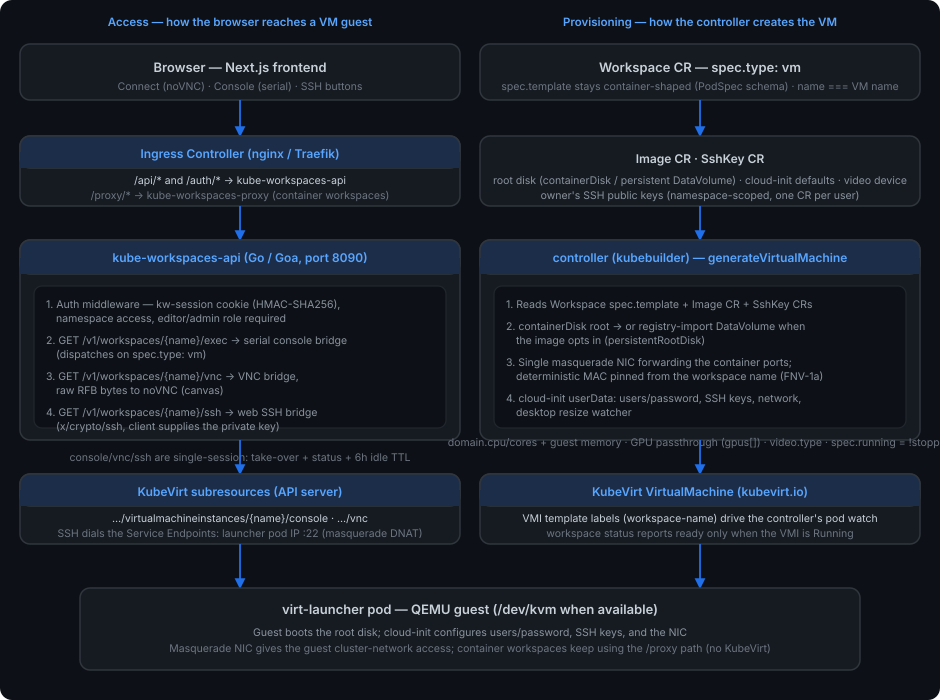

# Virtual Machines Architecture

This document describes how **virtual machine workspaces** work in
kube-workspaces. Unlike container workspaces (a `StatefulSet` + `Service` that
the [proxy](proxy.md) fronts) or scratch workspaces (a plain `Deployment`), a
**`vm`** workspace is backed by a KubeVirt `VirtualMachine` running a full guest
operating system in your cluster. The controller generates the `VirtualMachine`,
and the API exposes the guest through three WebSocket bridges — a **serial
console**, a **noVNC graphical display**, and a **web SSH session** — while the
browser traffic still lands on the same frontend and API you already know.

A VM workspace is nothing more than a `Workspace` CR with `spec.type: vm`. The
rest of the platform treats it like any other workspace: name, namespace, RBAC,
start/stop, volumes and the API surface are unchanged.

---

## Overview

When a user creates a VM workspace, the controller translates the
container-shaped `spec.template` into a KubeVirt `VirtualMachine` (the main
container image becomes the guest's root disk) and KubeVirt runs it as a
`virt-launcher` pod with QEMU. Users reach the guest — not through the HTTP
proxy (that is for container apps on port 80) — but through the API's
WebSocket bridges, which dial KubeVirt's aggregated subresources on the API
server.

```
workspace {{name}} in namespace {{ns}}
  ├── VirtualMachine (kubevirt.io) named {{name}}   ← generated by the controller
  │     └── VirtualMachineInstance {{name}}
  │           └── virt-launcher pod (QEMU, /dev/kvm)
  └── Service {{name}}:80                            ← still created; targets the launcher pod
```

The container-based proxy path is untouched: `vm` workspaces simply don't serve
an HTTP app on port 80 yet (that is a later phase; the Service remains for
networking identity and the SSH bridge). GUI and shell access are handled by
the API bridges described below.

---

## Component Architecture



The diagram is split into two planes that meet at the `virt-launcher` pod:

- **Access** (left) — the browser path through the frontend and the API's
  WebSocket bridges into the guest.
- **Provisioning** (right) — the controller turning `Workspace`/`Image`/`SshKey`
  CRs into a KubeVirt `VirtualMachine`.

---

## Workspace Types

Every workspace declares how it should be run via `spec.type` (default
`container`):

| Type | Backing workload | Access |
|------|------------------|--------|
| `container` | `StatefulSet` + `Service` | HTTP via the [proxy](proxy.md) |
| `vm` | KubeVirt `VirtualMachine` + `virt-launcher` pod | Serial console, noVNC display, web SSH (API bridges) |
| `scratch` | `Deployment` (generated pod names) | HTTP via the proxy |

`spec.template.spec` stays **container-shaped** for all types — the VM path
reuses the existing PodSpec schema (image, resources, ports, tolerations,
nodeSelector), so validation and the API payloads are unchanged. The API rejects
`volume_mounts` and `shared_memory` for `vm` workspaces today; `gpu_request` is
allowed and flows into the VM (see [GPU passthrough](#gpu-passthrough)).

---

## Provisioning — controller (`generateVirtualMachine`)

**Source:** `controller/internal/controller/workspace_controller.go`

The controller reconciles the `Workspace` CR and, for `spec.type: vm`, builds an
unstructured KubeVirt `VirtualMachine` (name and namespace equal the workspace's;
no new Go module dependency — the KubeVirt objects are handled with the dynamic
client). The important mappings:

### Root disk

The main container image becomes the guest's root disk:

- **containerDisk** (default) — the image is booted directly by QEMU as an
  ephemeral overlay; changes are lost on restart. Works for any OCI image, so
  the existing image pipeline (image string match, `containers[0].image`) is
  reused unchanged.
- **DataVolume root** — when the Image CR sets `spec.persistentRootDisk`, the
  controller emits a CDI registry-import `DataVolume` (PVC-backed) as the root,
  so the guest survives stops, reboots, and node moves. Size is
  `spec.persistentRootDiskSize` (default `10Gi`). Depends on CDI
  (`kubevirt.cdi.enabled` in the chart).

### Networking

A single **masquerade** interface is attached to the pod network, forwarding
every declared container port (the main container's `ports`, or the
`defaultPort`). KubeVirt rejects multiple interfaces bound to the same pod
network, so all ports share one interface. The interface carries a
**deterministic MAC address** (`macAddressForWorkspace`, FNV-1a over the
workspace name, locally-administered unicast `02:` prefix) so the guest's NIC
address survives VMI recreation — otherwise KubeVirt rolls a fresh random MAC on
every start and strands DHCP bindings and MAC-matched network configs.

### Resources

The main container's `requests`/`limits` are copied verbatim into
`domain.resources`, so CPU/memory and any GPU limits land in the guest domain.
Two refinements:

- `domain.cpu.cores` is pinned from the container's CPU **limit**, so a 4-CPU
  limit yields 4 vCPUs (KubeVirt otherwise defaults to 1).
- Guest **memory** is pinned via the Image CR: `spec.memoryLimit` sets the guest
  RAM, and `spec.memoryRequest` optionally decouples the `virt-launcher` pod
  allocation from the guest RAM (headroom for QEMU overhead). Requests and
  limits are kept equal so the workload stays QoS Guaranteed.

### GPU passthrough

Any container resource limit whose name is a known GPU resource
(`nvidia.com/gpu`, `amd.com/gpu`, `intel.com/gpu`, or any `*/gpu` key) is
emitted as both the scheduling resource in `domain.resources.limits` and a
KubeVirt `domain.devices.gpus[]` entry (`deviceName` = resource, `name` =
`gpuN`). The workspace's `nodeSelector`/`tolerations` are carried into the VMI
template so the `virt-launcher` pod can land on dedicated/tainted GPU nodes.

For the device to be attachable, the operator must also: enable IOMMU on the
host, run a device plugin advertising the resource, and allowlist the device in
the KubeVirt CR via the chart's `kubevirt.gpuPassthrough.permittedHostDevices`.
See [Installation](install.md) for the operator steps.

### Display device

The Image CR `spec.videoDevice` (enum `virtio;vga;bochs;cirrus;ramfb`) selects
the KubeVirt `domain.devices.video.type`. `virtio` attaches the virtio-gpu
paravirtual display — the recommended choice for desktop images: faster noVNC
rendering and guest-set resolutions (see [Fluid display resize](#fluid-display-resize)).
Unset lets KubeVirt auto-attach its default (VGA for BIOS, bochs for EFI). A
USB absolute tablet input is always attached (vm mouse pointer tracking).

### Cloud-init user-data

When the Image CR opts in (see [VM image fields](#vm-image-fields)), the
controller attaches a `cloudInitNoCloud` datasource with the user-data
**inlined as plaintext** in `cloudInitNoCloud.userData`:

- `defaultUserData` (explicit image-config) wins when set;
- otherwise `defaultCloudInit` + `defaultUser` + `defaultPassword` generate a
  `#cloud-config` that sets the account password (`chpasswd list:`, multi-line
  form — a YAML list is silently ignored by cloud-init).

Because a containerDisk root is ephemeral, cloud-init runs again on every start;
for DataVolume roots the user-data re-asserts on each boot (see `runcmd`
below).

### SSH key seeding

The workspace owner's `SshKey` CR public keys (namespace-scoped, created in the
user's personal namespace via the API) are merged into the generated user-data:

- `ssh_authorized_keys` seeds the keys on first boot (cloud-init's
  PER_INSTANCE module — only the first boot).
- a `runcmd` (PER_ALWAYS) entry idempotently appends the same keys to
  `~<user>/.ssh/authorized_keys` on **every** boot, base64-safe, so reboots
  never drop the keys again.

Keys are read by the controller at VM-create time via the uncached `APIReader`
(the controller does not watch `SshKey` CRs; new keys apply on the next
workspace patch or controller restart).

### Lifecycle & status

- `spec.running` is `!stopped` — stop/start is annotation-driven
  (`kubeworkspaces.io/stopped`), exactly like container workspaces.
- The VMI template carries the `workspace-name` label, so the existing pod watch
  maps the `virt-launcher` pod back to the workspace and populates status
  (`readyReplicas`, conditions). `readyReplicas` only counts when the VMI is
  actually in the `Running` phase, so a crashing/restarting guest is not
  reported as ready.
- A **2-minute cache resync** recreates missing VMs (a vanished
  `VirtualMachine` — e.g. after a KubeVirt platform teardown — is replaced on
  the next reconcile).

### KubeVirt presence detection

The controller probes the VM GVK on the cluster before generating anything. If
KubeVirt's CRDs are absent, a `type: vm` workspace sets a status condition
(`KubeVirtNotInstalled`) and is skipped — the controller does **not** crash and
container/scratch workspaces are unaffected.

---

## Access — API WebSocket bridges

**Source:** `api/internal/exec/vmconsole.go`, `vmvnc.go`, `ssh.go`

All three bridges require the `kw-session` authentication cookie
(HMAC-SHA256-signed, `ApiToken`/`ApiTokenV1`-style bearer also accepted), editor
or admin role, and namespace access — the same auth model as the container
[proxy](proxy.md) and the REST API. Each is single-session per workspace:
KubeVirt's serial console and VNC are **single-session, last-wins**, so a blind
second dial would silently sever the existing user. The API therefore runs a
`sessionRegistry` (one slot per workspace per mode) that returns **409
Conflict** while a session is held and exposes take-over/status endpoints.

### Serial console — `GET /v1/workspaces/{name}/exec`

Dispatch on `spec.type`: container → container exec into pod `{name}-0`;
scratch → exec into the label-resolved pod; **vm → the serial console bridge**.
The bridge upgrades the client to a WebSocket that dials the KubeVirt VMI
console subresource:

```
/apis/subresources.kubevirt.io/v1/namespaces/{ns}/virtualmachineinstances/{name}/console
```

- Uses the `plain.kubevirt.io` subprotocol and the API server's own
  **ServiceAccount bearer token** (read fresh from the projected token file —
  `consoleToken()` prefers the kubelet-rotated `BearerTokenFile` over the
  startup `BearerToken`, avoiding the ~1h console 401 class of bug).
- Raw serial stream — no shell is spawned. The guest image must run a **getty**
  on the console for a login prompt (stock cloud images do; the VM demo images
  autologin or set a password via cloud-init).
- Terminal `resize` control messages are swallowed (serial consoles have no
  resize channel); a 30s keepalive ping keeps idle consoles alive through
  intermediaries.

### VNC display — `GET /v1/workspaces/{name}/vnc`

For `vm` workspaces, the `/vnc` bridge dials the VMI VNC subresource
(`…/virtualmachineinstances/{name}/vnc`) and proxies **raw RFB bytes** — no
decoding server-side. The frontend attaches a noVNC `RFB` client to the bridge;
the two talk RFB end-to-end (including `SetDesktopSize` for fluid resize). Like
the console, VNC is a single-session, last-wins subresource, guarded by the same
registry with a strict 409 (no silent take-over for the display).

### Web SSH — `GET /v1/workspaces/{name}/ssh`

A browser-native SSH into the guest:

1. The client upgrades and sends a first JSON message:
   `{"type":"ssh","user":…,"privateKey":"<PEM>"}`. The private key is held in
   memory only, for the lifetime of the bridge — never persisted server-side.
2. The bridge dials the **Service Endpoints** address — the `virt-launcher` pod
   IP `:22`, where KubeVirt's masquerade DNAT forwards to the guest sshd — with
   `x/crypto/ssh`. (The Service ClusterIP does not DNAT correctly for VMs, so
   the pod-IP endpoints path is used; it works cross-node.)
3. Guest sshd host keys are self-generated and rotate per image rebuild, so no
   host-key verification is possible — instead the session rides the
   authenticated WebSocket over TLS to the API (auth at the API, not at the
   guest's sshd).

The guest must be running sshd and have one of the owner's seeded keys for
`defaultUser` (see [SSH key seeding](#ssh-key-seeding)).

### Sessions, take-over and control endpoints

| Endpoint | Purpose |
|----------|---------|
| `GET  /v1/workspaces/{name}/console/status` / `…/ssh/status` | `{"inUse": bool}` — is the session held? |
| `POST /v1/workspaces/{name}/console/takeover` / `…/ssh/takeover` | Force-end the held session so the caller can connect (returns `{"ok":true,"wasInUse":bool}`) |
| `POST /v1/workspaces/{name}/reboot` | Delete the VMI — KubeVirt recreates it from the parent VM; a DataVolume root is preserved |

A session held by a new owner receives a clean close frame
(`"taken over by another user"`), so the browser treats it as intentional
rather than auto-reconnecting in a fight against the new owner. Idle sessions
expire after a **6-hour TTL**. Reboot requires the VM type check and editor
role; it is a "cold" restart (VMI delete), not a guest-internal `reboot`.

### VM networking note (SSH target)

`vm` workspaces still get a `Service {name}:80` (the proxy path is untouched in
phase 1), but for VMs the Service's endpoints are the `virt-launcher` pod. The
SSH bridge deliberately dials those endpoints directly. Container workspaces
are unaffected.

---

## VM image fields

The Image CR (`controller/api/v1alpha1/image_types.go`) fields relevant to VM
workspaces, all of which the controller consumes at VM-create time:

| Field | Effect on VM workspaces |
|-------|-------------------------|
| `workspaceTypes` | Restricts which `spec.type`s an image can be used with (e.g. `[vm]`); the frontend hides the image for other types |
| `defaultUser` / `defaultPassword` | Credentials seeded into the guest via cloud-init (`chpasswd`); surfaced in the API result for the console/SSH login hints |
| `defaultCloudInit` | Declares the image runs cloud-init — required for user-data seeding |
| `defaultUserData` | Explicit cloud-init user-data (wins over generated defaults) |
| `persistentRootDisk` / `persistentRootDiskSize` | Root disk becomes a CDI registry-import DataVolume (default `10Gi`) |
| `memoryLimit` / `memoryRequest` | Guest RAM / `virt-launcher` pod allocation (decoupling keeps the workload Guaranteed) |
| `videoDevice` | KubeVirt `domain.devices.video.type` (e.g. `virtio` for virtio-gpu) |
| `defaultPort` / `additionalPorts` | Forwarded on the masquerade interface (same semantics as container Service ports) |

VM images live in the [image-catalog](https://github.com/kube-workspaces/image-catalog)
repo (`*`-vm images, e.g. `debian-xfce`, `debian-vm`, `alpine-vm`) and are
vendored into the deploy manifests.

---

## SSH keys (`SshKey` CR)

Web SSH need not use the in-browser serial console; it uses the user's existing
SSH keys. The `SshKey` CRD (`kubeworkspaces.io/v1alpha1`) stores one or more
public keys per user in their **personal namespace**:

- `spec.publicKey` — a full `ssh-ed25519 AAAA…` / `ssh-rsa AAAA…` line; validated
  against a known key type, with the fingerprint computed into `status`.
- Created/read/deleted via the API (`/v1/sshkeys*`) and the frontend Profile
  page; RBAC scopes reads to the caller's own namespace.

The controller injects these keys into VM user-data as described in
[SSH key seeding](#ssh-key-seeding), so a user's browser SSH session works with
whatever key they already use, without the server ever holding a private key.

---

## Frontend

**Sources:** `frontend/src/lib/use-serial-console.ts`,
`frontend/src/components/terminal-modal.tsx`, `frontend/src/components/vnc-display.tsx`

- Workspace detail page: a **type badge**, a prominent **Connect** button
  (noVNC display) next to **Console** (serial) and **SSH**, and a **Reboot**
  button. Connect/Console/SSH open the same shared modal, each selecting a
  different initial mode (display/serial/ssh); in-modal toggles switch between
  them, and a **Minimize** button docks the modal to a bottom status bar while
  keeping the WebSocket alive.
- The serial console uses an `xterm.js` hook with persistent state, automatic
  reconnect (capped exponential backoff), take-over consent prompts, and clean
  close detection.
- The display console drives noVNC with `scaleViewport` + `resizeSession`
  (assigned **after** construction — noVNC silently ignores them in the
  constructor options).
- VM views gain a YAML-tab **User Data** button rendering
  `cloudInitNoCloud.userData` live from the VM.

### Fluid display resize

`resizeSession` lets noVNC observe its container and send VNC `SetDesktopSize`
to QEMU (good under the virtio-gpu driver). QEMU updates the virtio-gpu EDID to
the new preferred mode, but the guest's Xorg session does not apply it by
itself — so the desktop images install a persistent systemd poller
(`kw-display-resize` service) that watches the DRM preferred-mode sysfs file
every 0.5s and applies the settled size with `xrandr --auto`. Result: resizing
the browser modal resizes the guest display live, both directions.

---

## Deployment

KubeVirt is a **prerequisite installed separately** (or via the chart):

- Chart values: `kubevirt.enabled` installs the vendored upstream KubeVirt
  operator + the `KubeVirt` CR into the `kubevirt` namespace; `useEmulation`
  runs guests without `/dev/kvm` (kind/CI — slow; set `false` on real nodes with
  KVM); `kubevirt.cdi.enabled` installs CDI for DataVolume roots.
- RBAC (shared `kube-workspaces-manager` ClusterRole, mirrored into kustomize
  and helm): `virtualmachines` CRUD; `virtualmachineinstances` get/list/watch/
  delete (delete powers `/reboot`); `subresources.kubevirt.io`
  `virtualmachineinstances/console` + `…/vnc` get (the API bridges); and CDI
  `datavolumes` for persistent roots. `compare-rbac.py` keeps the kustomize and
  helm copies in sync.

See [Installation](install.md) for the KubeVirt prerequisite, GPU/IOMMU operator
steps, and kind setup.

---

## See also

- [Proxy](proxy.md) — how container/scratch workspace HTTP traffic is routed
  (unchanged by VM support)
- [API Reference](api.md) — the REST API, including the console `/status` /
  `/takeover` and `/reboot` endpoints
- [Image catalog](https://github.com/kube-workspaces/image-catalog) — the VM
  image definitions and their fields