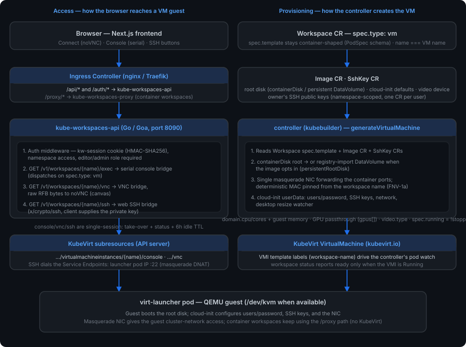

# Virtual Machines Architecture

This document describes how **virtual machine workspaces** work in
kube-workspaces. Unlike container workspaces (a `StatefulSet` + `Service` that
the [proxy](proxy.md) fronts) or scratch workspaces (a plain `Deployment`), a
**`vm`** workspace is backed by a KubeVirt `VirtualMachine` running a full guest
operating system in your cluster. The controller generates the `VirtualMachine`,
and the API exposes the guest through three WebSocket bridges — a **serial
console**, a **noVNC graphical display**, and a **web SSH session** — while the
browser traffic still lands on the same frontend and API you already know.

A VM workspace is nothing more than a `Workspace` CR with `spec.type: vm`. The
rest of the platform shares its name, namespace, RBAC and start/stop model.
VM disks and guest access have their own mappings, described below.

---

## Overview

When a user creates a VM workspace, the controller translates the
container-shaped `spec.template` into a KubeVirt `VirtualMachine` (the main
container image becomes the guest's root disk) and KubeVirt runs it as a
`virt-launcher` pod with QEMU. Users reach the guest through the API's console
bridges or, for an in-guest web app on a declared port, through the HTTP proxy
and workspace Service. The serial/VNC bridges dial KubeVirt's aggregated
subresources on the API server; the SSH bridge dials the launcher endpoint.

```
workspace {{name}} in namespace {{ns}}
  ├── VirtualMachine (kubevirt.io) named {{name}}   ← generated by the controller
  │     └── VirtualMachineInstance {{name}}
  │           └── virt-launcher pod (QEMU, /dev/kvm)
  └── Service {{name}}:80                            ← still created; targets the launcher pod
```

The first declared guest port maps to Service port 80, and KubeVirt's masquerade
interface forwards it into the guest. This Service path was verified under KVM
with an in-guest Selkies HTTP server. The guest must run an app on that target
port: a Service targeting SSH port 22 is not an HTTP endpoint. The VM Connect
button opens the noVNC display; console access is described below.

---

## Component Architecture



The diagram is split into two planes that meet at the `virt-launcher` pod:

- **Access** (left) — the browser path through the frontend and the API's
  WebSocket bridges into the guest.
- **Provisioning** (right) — the controller turning `Workspace`/`Image`/`SshKey`
  CRs into a KubeVirt `VirtualMachine`.

---

## Workspace Types

Every workspace declares how it should be run via `spec.type` (default
`container`):

| Type | Backing workload | Access |
|------|------------------|--------|
| `container` | `StatefulSet` + `Service` | HTTP via the [proxy](proxy.md) |
| `vm` | KubeVirt `VirtualMachine` + `virt-launcher` pod | Serial console, noVNC display, web SSH (API bridges) |
| `scratch` | `Deployment` (generated pod names) | HTTP via the proxy |

`spec.template.spec` stays **container-shaped** for all types — the VM path
reuses the existing PodSpec schema (image, resources, ports, tolerations,
nodeSelector), so validation and the API payloads are unchanged. The API rejects
`shared_memory` for `vm` workspaces. `volume_mounts` reference reusable CDI
data disks and guest mount paths for VMs (see below); `gpu_request` is allowed
and flows into the VM (see [GPU passthrough](#gpu-passthrough)).

---

## Provisioning — controller (`generateVirtualMachine`)

**Source:** `controller/internal/controller/workspace_controller.go`

The controller reconciles the `Workspace` CR and, for `spec.type: vm`, builds an
unstructured KubeVirt `VirtualMachine` (name and namespace equal the workspace's;
no new Go module dependency — the KubeVirt objects are handled with the dynamic
client). The important mappings:

### Root disk

The main container image becomes the guest's root disk:

- **containerDisk** (default) — the image is booted directly by QEMU as an
  ephemeral overlay; changes are lost on restart. Works for any OCI image, so
  the existing image pipeline (image string match, `containers[0].image`) is
  reused unchanged.
- **DataVolume root** — when the Image CR sets `spec.persistentRootDisk`, the
  controller emits a CDI registry-import `DataVolume` (PVC-backed) as the root,
  so the guest survives stops, reboots, and node moves. Size is
  `spec.persistentRootDiskSize` (default `10Gi`). Depends on CDI
  (`kubevirt.cdi.enabled` in the chart).

### Reusable guest data disks

Create a volume with API payload `type: vm-disk` (or choose **VM Data Disk** in
Volumes → New). CDI creates a blank, filesystem-mode DataVolume/PVC with
ReadWriteOnce access. It appears in Volumes while pending and once bound; CDI
must be installed. Existing container PVCs cannot be converted to guest disks.

Attach it when creating a VM through the workspace's `volume_mounts`, for example:

```json
"volume_mounts": [{"name": "project-data", "mount_path": "/data"}]
```

The workspace's Image must support cloud-init with `#cloud-config` user-data.
The controller adds a virtio disk with a stable serial and a per-boot command
using `/dev/disk/by-id/virtio-…`, rather than unstable `/dev/vdb` ordering. It
formats a signature-free blank disk as ext4 on first use, then mounts existing
ext4 data unchanged on subsequent boots. Partitioned/other filesystem disks are
not reformatted. A newly formatted mount is assigned to the Image's default
user when that account already exists; existing data ownership is preserved.
Mount paths must be unique, clean absolute data paths; system paths such as
`/`, `/etc`, `/dev` and `/usr` are rejected.

Data disks are **independent of the workspace**: stop/start, Reboot, Reset and
workspace deletion retain them. Delete them explicitly through Volumes when
no longer needed. Reset still reprovisions only the VM-owned root disk.
One writable workspace can claim a data disk at a time, including while stopped.
To reattach it to another workspace, delete the old workspace and wait for its
VMI to disappear. The controller serializes claims with resource-version
updates; the API refuses deletion while a workspace/VMI uses the disk.
Disk hotplug, resize and changing attachment lists through PUT are not supported
in this version; recreate the workspace to change its disk attachments.

### Networking

A single **masquerade** interface is attached to the pod network, forwarding
every declared container port (the main container's `ports`, or the
`defaultPort`). KubeVirt rejects multiple interfaces bound to the same pod
network, so all ports share one interface. The interface carries a
**deterministic MAC address** (`macAddressForWorkspace`, FNV-1a over the
workspace name, locally-administered unicast `02:` prefix) so the guest's NIC
address survives VMI recreation — otherwise KubeVirt rolls a fresh random MAC on
every start and strands DHCP bindings and MAC-matched network configs.

The `debian-xfce` catalog defaults also replace the base cloud image's netplan
configuration with a MAC-independent `en*` match using DHCP and
`systemd-networkd`. A per-boot command applies it before package installation,
disables cloud-init network regeneration, and writes an editable static
`/etc/resolv.conf` with public resolvers `1.1.1.1` and `9.9.9.9`. Operators
requiring cluster-internal DNS or restricting public DNS egress should customize
these addresses in the Image's `defaultUserData`.
Catalog-default changes require catalog release/vendoring and do not retrofit
an already-provisioned persistent guest automatically.

### Resources

The main container's `requests`/`limits` are copied verbatim into
`domain.resources`, so CPU/memory and any GPU limits land in the guest domain.
Two refinements:

- `domain.cpu.cores` is pinned from the container's CPU **limit**, so a 4-CPU
  limit yields 4 vCPUs (KubeVirt otherwise defaults to 1).
- Guest **memory** is pinned via the Image CR: `spec.memoryLimit` sets the guest
  RAM, and `spec.memoryRequest` optionally decouples the `virt-launcher` pod
  allocation from the guest RAM (headroom for QEMU overhead). Requests and
  limits are kept equal so the workload stays QoS Guaranteed.

### GPU passthrough

Any container resource limit whose name is a known GPU resource
(`nvidia.com/gpu`, `amd.com/gpu`, `intel.com/gpu`, or any `*/gpu` key) is
emitted as both the scheduling resource in `domain.resources.limits` and a
KubeVirt `domain.devices.gpus[]` entry (`deviceName` = resource, `name` =
`gpuN`). The workspace's `nodeSelector`/`tolerations` are carried into the VMI
template so the `virt-launcher` pod can land on dedicated/tainted GPU nodes.

For the device to be attachable, the operator must also: enable IOMMU on the
host, run a device plugin advertising the resource, and allowlist the device in
the KubeVirt CR via the chart's `kubevirt.gpuPassthrough.permittedHostDevices`.
See [Installation](install.md) for the operator steps.

### Display device

The Image CR `spec.videoDevice` (enum `virtio;vga;bochs;cirrus;ramfb`) selects
the KubeVirt `domain.devices.video.type`. `virtio` attaches the virtio-gpu
paravirtual display — the recommended choice for desktop images: faster noVNC
rendering and guest-set resolutions (see [Fluid display resize](#fluid-display-resize)).
Unset lets KubeVirt auto-attach its default (VGA for BIOS, bochs for EFI). A
USB absolute tablet input is always attached (vm mouse pointer tracking).

### Cloud-init user-data

When the Image CR opts in (see [VM image fields](#vm-image-fields)), the
controller attaches a `cloudInitNoCloud` datasource with the user-data
**inlined as plaintext** in `cloudInitNoCloud.userData`:

- `defaultUserData` (explicit image-config) wins when set;
- otherwise `defaultCloudInit` + `defaultUser` + `defaultPassword` generate a
  `#cloud-config` that sets the account password (`chpasswd list:`, multi-line
  form — a YAML list is silently ignored by cloud-init).

Because a containerDisk root is ephemeral, cloud-init runs again on every start.
For DataVolume roots, first-boot modules such as `ssh_authorized_keys` and
`runcmd` are PER_INSTANCE: a restart does not re-run them.

### SSH key seeding

The controller watches `SshKey` create/update/delete events and reconciles all
VM workspaces in the same personal namespace, including stopped VMs.

For Images declaring `defaultUser` and opting in with the metadata annotation
`kubeworkspaces.io/ssh-key-propagation: qemuGuestAgent`, it maintains a
Workspace-owned `{name}-sshkeys`
Secret and attaches it through KubeVirt's `accessCredentials.sshPublicKey`
with `qemuGuestAgent` propagation to that user. The Secret is attached even when
the key list is empty, so the first addition and last deletion both propagate
without recreating the VM. Keys are not baked into these guests' cloud-init
data; this avoids restoring revoked keys on reboot.

**The platform owns that guest user's entire `authorized_keys` file.** Manual
guest entries are replaced; save every desired public key as a `SshKey` CR.
Deleting a CR revokes the key when KubeVirt synchronizes the Secret. Delivery is
eventual (Secret-volume refresh plus KubeVirt's agent polling), not synchronous
with the API response, and does not terminate already-open SSH sessions.

The guest must install and run `qemu-guest-agent` and permit its SSH-key commands.
The Debian VM and XFCE catalog defaults install and start the agent and opt in
with this annotation. Cloud-init capability alone does not opt an Image in;
existing custom images keep their first-boot behavior. Images without an agent cannot synchronize
keys through this mechanism. Inspect the VMI's `AgentConnected` and
`AccessCredentialsSynchronized` conditions when diagnosing failed delivery:

```sh
kubectl -n "$NAMESPACE" get vmi "$WORKSPACE" -o jsonpath='{.status.conditions}'
```

**Existing VMs need one stop/start or platform Reboot** after the controller
adds the credential reference: KubeVirt cannot attach a new credential Secret
to a running VMI. No restart is forced. Once attached, additions, rotations and
deletions apply live. Persistent disks are preserved by Reboot; Reset reprovisions
the guest and is not needed for migration. Save existing manual keys in the
Profile's SSH-key list before migrating.

For other Images, the controller retains `ssh_authorized_keys` first-boot
cloud-init seeding. Neither that module nor `runcmd` guarantees re-seeding on
reboot, and deletion does not revoke keys already written to those guests.

### Lifecycle & status

- `spec.running` is `!stopped` — stop/start is annotation-driven
  (`kubeworkspaces.io/stopped`), exactly like container workspaces.
- The VMI template carries the `workspace-name` label, so the existing pod watch
  maps the `virt-launcher` pod back to the workspace and populates status
  (`readyReplicas`, conditions). `readyReplicas` only counts when the VMI is
  actually in the `Running` phase, so a crashing/restarting guest is not
  reported as ready.
- A **2-minute cache resync** recreates missing VMs (a vanished
  `VirtualMachine` — e.g. after a KubeVirt platform teardown — is replaced on
  the next reconcile).

### KubeVirt presence detection

The controller probes the VM GVK on the cluster before generating anything. If
KubeVirt's CRDs are absent, a `type: vm` workspace sets a status condition
(`KubeVirtNotInstalled`) and is skipped — the controller does **not** crash and
container/scratch workspaces are unaffected.

---

## Access — API WebSocket bridges

**Source:** `api/internal/exec/vmconsole.go`, `vmvnc.go`, `ssh.go`

All three bridges require the `kw-session` authentication cookie
(HMAC-SHA256-signed, `ApiToken`/`ApiTokenV1`-style bearer also accepted), editor
or admin role, and namespace access — the same auth model as the container
[proxy](proxy.md) and the REST API. Each is single-session per workspace:
KubeVirt's serial console and VNC are **single-session, last-wins**, so a blind
second dial would silently sever the existing user. The API therefore runs a
`sessionRegistry` (one slot per workspace per mode) that returns **409
Conflict** while a session is held and exposes take-over/status endpoints.

### Serial console — `GET /v1/workspaces/{name}/exec`

Dispatch on `spec.type`: container → container exec into pod `{name}-0`;
scratch → exec into the label-resolved pod; **vm → the serial console bridge**.
The bridge upgrades the client to a WebSocket that dials the KubeVirt VMI
console subresource:

```
/apis/subresources.kubevirt.io/v1/namespaces/{ns}/virtualmachineinstances/{name}/console
```

- Uses the `plain.kubevirt.io` subprotocol and the API server's own
  **ServiceAccount bearer token** (read fresh from the projected token file —
  `consoleToken()` prefers the kubelet-rotated `BearerTokenFile` over the
  startup `BearerToken`, avoiding the ~1h console 401 class of bug).
- Raw serial stream — no shell is spawned. The guest image must run a **getty**
  on the console for a login prompt (stock cloud images do; the VM demo images
  autologin or set a password via cloud-init).
- Terminal `resize` control messages are swallowed (serial consoles have no
  resize channel); a 30s keepalive ping keeps idle consoles alive through
  intermediaries.

### VNC display — `GET /v1/workspaces/{name}/vnc`

For `vm` workspaces, the `/vnc` bridge dials the VMI VNC subresource
(`…/virtualmachineinstances/{name}/vnc`) and proxies **raw RFB bytes** — no
decoding server-side. The frontend attaches a noVNC `RFB` client to the bridge;
the two talk RFB end-to-end (including `SetDesktopSize` for fluid resize). Like
the console, VNC is a single-session, last-wins subresource, guarded by the same
registry with a strict 409 (no silent take-over for the display).

#### Adaptive Quality Controller (AQC)

The VNC display includes an **Adaptive Quality Controller** that dynamically
tunes the visual experience based on real-time network conditions:

- **Metrics Engine:** The frontend hooks the underlying WebSocket to measure
  **throughput** (bytes/sec) and **RTT** (latency). RTT is measured by
  injecting VNC `FramebufferUpdateRequest` messages and timing the server's
  response.
- **Adaptive Quality:** Based on these metrics, the controller selects one of
  three quality tiers (Poor, Fair, Good) and updates `rfb.qualityLevel` and
  `rfb.compressionLevel` on the fly. A 3-second **hysteresis** prevents
  quality "flapping" during jittery network conditions.
- **Lossless Refresh:** To ensure a sharp image for static content, the
  controller detects when motion stops. After 1 second of idle time, it
  requests a full-screen refresh at quality level 9 to improve static text and
  UI clarity. **QEMU quality level 9 still permits JPEG**; it does not guarantee
  lossless pixels. True lossless mode requires omitting the JPEG-quality
  pseudo-encoding from a new encoding list, as described below.
- **Server-side Logging:** The API bridge includes a `throughputLogger` (enabled via
  `AQC_DEBUG_THROUGHPUT=1` on the API pod) for server-side bandwidth monitoring.

#### Native desktop client — adaptive RFB quality

The native client's RFB controller is implemented
and enabled by default in shell/CLI graphical sessions (matching the web
client), with per-generation configuration, shared adaptive request cadence,
manual override flags, and the one-second lossless idle refresh. Tier
transitions, hysteresis, pressure/recovery, refresh-feedback, cancellation,
pacing, and controller-shutdown tests pass, as do build/vet/full tests/race/
lint and the six-target cross-builds.

The native client uses the same API `/vnc` WebSocket bridge to QEMU. Its
controller lives in `desktop-client/internal/rfb/adaptive.go`, with connection
wiring in `internal/rfb/conn.go`. This is client-side behavior: it requires no
additional guest agent, Helm value, API setting, or proxy route.

When enabled, the controller:

- Samples framebuffer bytes, changed pixel area, decoder occupancy, and
  request-to-update latency in 400 ms windows. Audio traffic is excluded from
  the framebuffer byte samples. Latency is a response-time proxy, not ping RTT;
  incremental requests can wait for guest damage. Decoder occupancy includes
  time waiting for incoming data, not just CPU processing.
- Starts at **Good**, drops one tier immediately under throughput, latency, or
  decoder pressure, and recovers one tier after 2 seconds of continuous
  headroom. It re-sends `SetEncodings` while preserving audio and other feature
  advertisements.
- After sustained low motion (600 ms, evaluated on the sampling cadence),
  switches to lossless and requests one non-incremental full-screen repaint.
  The repaint itself is suppressed from motion feedback so it does not cause
  repeated idle refreshes.
- Exposes a recommended request interval through `Conn.QualityInterval()`:
  16 ms while active and 80 ms while idle, and the session loop now consumes
  this recommendation as its request cadence.

The initial tier table is **provisional**, awaiting a live video/scrolling probe
sweep. These are pressure thresholds, not measured network capacity:

| Tier | Tight JPEG quality | Compression level | Throughput pressure threshold |
|------|--------------------|-------------------|-------------------------------|
| Poor | 3 | 9 | 500,000 bytes/s |
| Fair | 6 | 6 | 2,000,000 bytes/s |
| Good | 8 | 3 | 8,000,000 bytes/s |
| Lossless | Omitted (`Quality: -1`) | 3 | 32,000,000 bytes/s |

QEMU resets JPEG quality to disabled when processing a new `SetEncodings`
without a quality pseudo-encoding. Sending quality 9 instead would still allow
lossy JPEG, so the native lossless tier deliberately omits it.

Automated checks cover tier transitions, hysteresis, idle refresh, configuration
validation, encoding and repaint messages, audio-advertisement preservation,
and controller shutdown on EOF.

### Native VNC and serial access with `virtctl`

Operators with Kubernetes access can connect directly through KubeVirt using
[`virtctl`](https://kubevirt.io/user-guide/user_workloads/virtctl_client_tool/).
Use a `virtctl` version matching the installed KubeVirt release and a kubeconfig
for the target cluster. These commands use Kubernetes credentials, rather than
the kube-workspaces browser session or native-client login.

Set the workspace's namespace and name (the VM/VMI has the same name):

```sh
NAMESPACE=your-personal-namespace
WORKSPACE=your-vm-workspace
kubectl -n "$NAMESPACE" get vmi "$WORKSPACE"
kubectl auth can-i get virtualmachineinstances/vnc --api-group=subresources.kubevirt.io -n "$NAMESPACE"
```

With `remote-viewer` installed locally (commonly the `virt-viewer` package),
launch a graphical viewer:

```sh
virtctl -n "$NAMESPACE" vnc "$WORKSPACE"
```

To use a different VNC viewer, keep a local proxy running:

```sh
virtctl -n "$NAMESPACE" vnc --proxy-only "$WORKSPACE"
```

Connect the viewer to `127.0.0.1` at the port printed by `virtctl`, for example
`remote-viewer vnc://127.0.0.1:5900` if the printed port is 5900. Leave the
proxy process running until you close the viewer, then stop it with Ctrl-C.
No guest VNC server, Service exposure, or public VNC port is needed: traffic
is tunneled through the Kubernetes API to QEMU.

For a serial console (a guest getty is required):

```sh
kubectl auth can-i get virtualmachineinstances/console --api-group=subresources.kubevirt.io -n "$NAMESPACE"
virtctl -n "$NAMESPACE" console "$WORKSPACE"
```

Use Ctrl-] to leave the serial console. Kubernetes RBAC must grant `get` on
`virtualmachineinstances/vnc` or `virtualmachineinstances/console` in API group
`subresources.kubevirt.io`, scoped to the target namespace; a platform editor
role alone does not supply kubeconfig credentials. A stopped VM must be started
before either console is available.

Direct `virtctl` access bypasses the platform's display leases, shared-display
membership, and takeover prompts. Close browser/native display sessions first
and coordinate with other users: another direct VNC or serial connection can
fail or displace the active connection. For shared viewing and consent-based
control transfer, use the platform clients. To diagnose tunnel failures, add
`-v 4` to the `virtctl` command and check the VMI's status and your RBAC.

### Web SSH — `GET /v1/workspaces/{name}/ssh`

A browser-native SSH into the guest:

1. The client upgrades and sends a first JSON message:
   `{"type":"ssh","user":…,"privateKey":"<PEM>"}`. The private key is held in
   memory only, for the lifetime of the bridge — never persisted server-side.
2. The bridge dials the **Service Endpoints** address — the `virt-launcher` pod
   IP `:22`, where KubeVirt's masquerade DNAT forwards to the guest sshd — with
   `x/crypto/ssh`. The bridge retains this direct-endpoint path; Service→guest
   HTTP routing has also been verified under KVM.
3. Guest sshd host keys are self-generated and rotate per image rebuild, so no
   host-key verification is possible — instead the session rides the
   authenticated WebSocket over TLS to the API (auth at the API, not at the
   guest's sshd).

The guest must be running sshd and have one of the owner's propagated keys for
`defaultUser` (see [SSH key seeding](#ssh-key-seeding)).

### Sessions, take-over and control endpoints

| Endpoint | Purpose |
|----------|---------|
| `GET  /v1/workspaces/{name}/console/status` / `…/ssh/status` | `{"inUse": bool}` — is the session held? |
| `POST /v1/workspaces/{name}/console/takeover` / `…/ssh/takeover` | Force-end the held session so the caller can connect (returns `{"ok":true,"wasInUse":bool}`) |
| `POST /v1/workspaces/{name}/reboot` | Delete the VMI — KubeVirt recreates it from the parent VM; a DataVolume root is preserved |

A session held by a new owner receives a clean close frame
(`"taken over by another user"`), so the browser treats it as intentional
rather than auto-reconnecting in a fight against the new owner. Idle sessions
expire after a **6-hour TTL**. Reboot requires the VM type check and editor
role; it is a "cold" restart (VMI delete), not a guest-internal `reboot`.

### VM networking note (SSH target)

`vm` workspaces still get a `Service {name}:80` (the proxy path is untouched in
phase 1), but for VMs the Service's endpoints are the `virt-launcher` pod. The
SSH bridge deliberately dials those endpoints directly. Container workspaces
are unaffected.

---

## VM image fields

The Image CR (`controller/api/v1alpha1/image_types.go`) fields relevant to VM
workspaces, all of which the controller consumes at VM-create time:

| Field | Effect on VM workspaces |
|-------|-------------------------|
| `workspaceTypes` | Restricts which `spec.type`s an image can be used with (e.g. `[vm]`); the frontend hides the image for other types |
| `defaultUser` / `defaultPassword` | Credentials seeded into the guest via cloud-init (`chpasswd`); surfaced in the API result for the console/SSH login hints |
| `defaultCloudInit` | Declares the image runs cloud-init — required for user-data seeding |
| `defaultUserData` | Explicit cloud-init user-data (wins over generated defaults) |
| `persistentRootDisk` / `persistentRootDiskSize` | Root disk becomes a CDI registry-import DataVolume (default `10Gi`) |
| `memoryLimit` / `memoryRequest` | Guest RAM / `virt-launcher` pod allocation (decoupling keeps the workload Guaranteed) |
| `videoDevice` | KubeVirt `domain.devices.video.type` (e.g. `virtio` for virtio-gpu) |
| `defaultPort` / `additionalPorts` | Forwarded on the masquerade interface (same semantics as container Service ports) |

VM images live in the [image-catalog](https://github.com/kube-workspaces/image-catalog)
repo (`*`-vm images, e.g. `debian-xfce`, `debian-vm`, `alpine-vm`) and are
vendored into the deploy manifests.

---

## SSH keys (`SshKey` CR)

Web SSH need not use the in-browser serial console; it uses the user's existing
SSH keys. The `SshKey` CRD (`kubeworkspaces.io/v1alpha1`) stores one or more
public keys per user in their **personal namespace**:

- `spec.publicKey` — a full `ssh-ed25519 AAAA…` / `ssh-rsa AAAA…` line; validated
  against a known key type, with the fingerprint computed into `status`.
- Created/read/deleted via the API (`/v1/sshkeys*`) and the frontend Profile
  page; RBAC scopes reads to the caller's own namespace.

The controller injects these keys into VM user-data as described in
[SSH key seeding](#ssh-key-seeding), so a user's browser SSH session works with
whatever key they already use, without the server ever holding a private key.

---

## Frontend

**Sources:** `frontend/src/lib/use-serial-console.ts`,
`frontend/src/components/terminal-modal.tsx`, `frontend/src/components/vnc-display.tsx`

- Workspace detail page: a **type badge**, a prominent **Connect** button
  (noVNC display) next to **Console** (serial) and **SSH**, and a **Reboot**
  button. Connect/Console/SSH open the same shared modal, each selecting a
  different initial mode (display/serial/ssh); in-modal toggles switch between
  them, and a **Minimize** button docks the modal to a bottom status bar while
  keeping the WebSocket alive.
- The serial console uses an `xterm.js` hook with persistent state, automatic
  reconnect (capped exponential backoff), take-over consent prompts, and clean
  close detection.
- The display console drives noVNC with `scaleViewport` + `resizeSession`
  (assigned **after** construction — noVNC silently ignores them in the
  constructor options).
- VM views gain a YAML-tab **User Data** button rendering
  `cloudInitNoCloud.userData` live from the VM.

### Fluid display resize

`resizeSession` lets noVNC observe its container and send VNC `SetDesktopSize`
to QEMU (good under the virtio-gpu driver). QEMU updates the virtio-gpu EDID to
the new preferred mode, but the guest's Xorg session does not apply it by
itself — so the desktop images install a persistent systemd poller
(`kw-display-resize` service) that watches the DRM preferred-mode sysfs file
every 0.5s and applies the settled size with `xrandr --auto`. Result: resizing
the browser modal resizes the guest display live, both directions.

---

## Deployment

KubeVirt is a **prerequisite installed separately** (or via the chart):

- Chart values: `kubevirt.enabled` installs the vendored upstream KubeVirt
  operator + the `KubeVirt` CR into the `kubevirt` namespace; `useEmulation`
  runs guests without `/dev/kvm` (kind/CI — slow; set `false` on real nodes with
  KVM); `kubevirt.cdi.enabled` installs CDI for DataVolume roots.
- RBAC (shared `kube-workspaces-manager` ClusterRole, mirrored into kustomize
  and helm): `virtualmachines` CRUD; `virtualmachineinstances` get/list/watch/
  delete (delete powers `/reboot`); `subresources.kubevirt.io`
  `virtualmachineinstances/console` + `…/vnc` get (the API bridges); and CDI
  `datavolumes` for persistent roots. `compare-rbac.py` keeps the kustomize and
  helm copies in sync.

See [Installation](install.md) for the KubeVirt prerequisite, GPU/IOMMU operator
steps, and kind setup.

---

## See also

- [Proxy](proxy.md) — how container/scratch workspace HTTP traffic is routed
  (unchanged by VM support)
- [API Reference](api.md) — the REST API, including the console `/status` /
  `/takeover` and `/reboot` endpoints
- [Image catalog](https://github.com/kube-workspaces/image-catalog) — the VM
  image definitions and their fields
